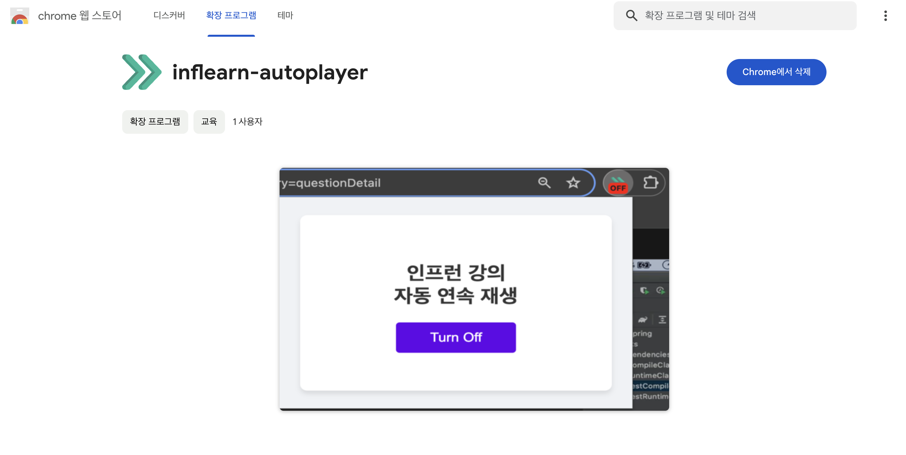

# Inflearn Auto Player

인프런 자동 재생 / 연속 재생 크롬 확장 프로그램

### 내가 쓰려고 만든 아주 간단한 크롬 확장 프로그램

인프런은 하나의 강의 섹션이 10분 내외 영상 여러개로 나뉘어 있습니다. 이때 각 영상이 끝날 때마다 다음 강의 버튼을 누르는 것이 귀찮게 느껴졌습니다. 저만 느끼는 불편이 아니며 많은 학습자들의 몰입을 방해할 수 있다 느껴 이 확장 프로그램을 만들게 되었습니다.

MutationObserver를 사용해 다음 강의 재생 팝업이 나오면 바로 클릭해줍니다. 확장 프로그램 아이콘 뱃지에 ON/OFF가 표시됩니다. 연속으로 여러 강의가 넘어가는 것을 방지하기 위해 3초 대기 시간을 두었습니다.

제가 사용하고 싶어서 빠르게 만들어 보았는데, 제대로 작동하지 않는다거나 문제점이 보이면 알려주시면 감사하겠습니다. 크롬 확장 프로그램 스토어에 공개되어 있습니다.

https://chromewebstore.google.com/detail/inflearn-autoplayer/omadkhceoicbnddndnanjghjfjhnajok
